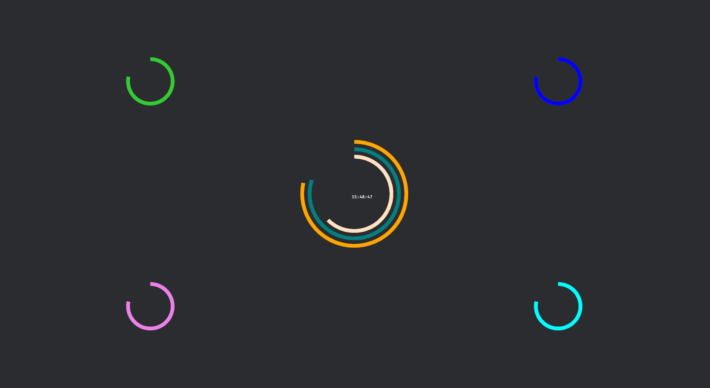

<a name="readme-top"></a>

# Bevy Clock Gizmo

<div align="center"> 
     
</div>

<details> 
    <summary>Contents</summary>
    <ol> 
        <li> 
            <a href="#introduction">Introduction</a> 
        </li>
        </li> 
        <li> 
            <a href="#installation-and-setup">Installation and Setup</a> 
        </li> 
        <li> 
            <a href="#usage">Usage</a> 
        </li> 
        <li> 
            <a href="#contributing">Contributing</a> 
        </li> 
        <li> 
            <a href="#license">License</a> 
        </li> 
        <li> 
            <a href="#acknowledgments">Acknowledgments</a> 
        </li> 
    </ol> 
</details>

## Introduction

Welcome to Bevy Clock Gizmo! This project is a testament to the power of the Bevy engine, a modern, efficient Rust framework for building graphical tools. Inspired by Tim McNamara's insightful YouTube video on Bevy's capabilities, this project aims to demonstrate the versatility of Rust in creating visually appealing applications.

[Tim McNamara's video](https://www.youtube.com/watch?v=jhI69fodWUY&ab_channel=timClicks) showcases the potential of Bevy in a way that's both educational and inspiring. For more on Tim's work, check out his [LinkedIn profile](https://www.linkedin.com/in/timmcnamaranz/). 

In this project, we've created a clock gizmo using Bevy's powerful tools. The clock face is dynamically rendered with customizable colors and responsive design, offering a visually appealing experience. This project is ideal for those interested in exploring the capabilities of Rust and Bevy in graphical programming, and aren't sure where to start.

## Installation and Setup

Make sure you have rust installed. Beyond that dynamic linking is enabled in the `Cargo.toml` file by default, so disable if you do not want to use that feature (bevy recommended)

## Usage

```bash
cargo run
```

## Contributing

Any and all contributions are welcome. This was a simple project. I may try to grow it I may not, will welcome all PR's and issues. 

## License

This project is licensed under the MIT License - see the [LICENSE](LICENSE) file for details.

## Acknowledgments

A special thanks to Tim McNamara for his invaluable insights into Rust and Bevy. His YouTube video was a key inspiration for this project. The Bevy community is also greatly appreciated for their support and contributions to the Rust ecosystem.